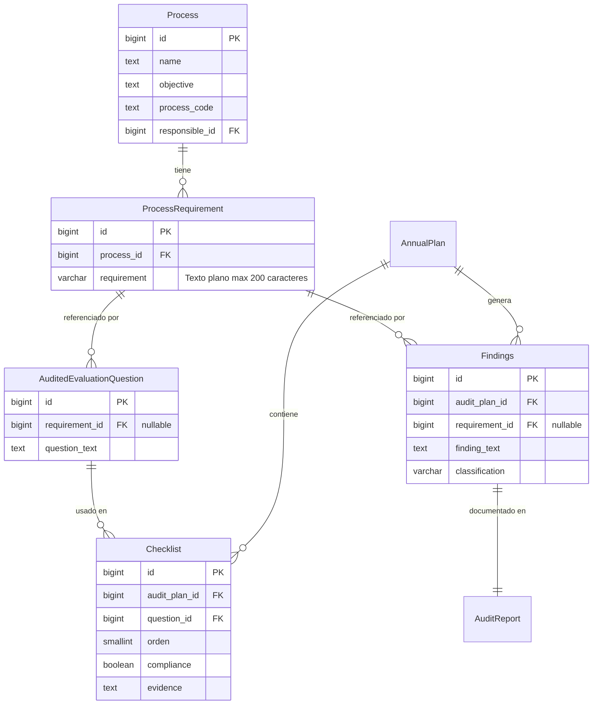
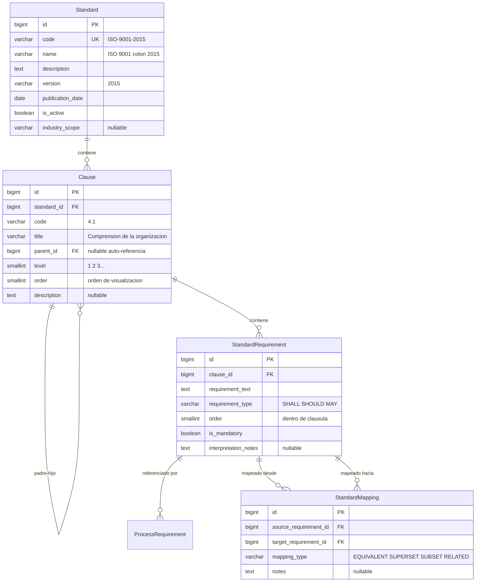

# Plan de Refactorización Arquitectónica Multi-Norma
---

## Tabla de Contenidos

1. [Análisis de la Arquitectura Actual](#1-análisis-de-la-arquitectura-actual)
2. [Limitaciones Arquitectónicas Identificadas](#2-limitaciones-arquitectónicas-identificadas)
3. [Arquitectura Normativa Propuesta](#3-arquitectura-normativa-propuesta)
4. [Refactorización de ProcessRequirement](#4-refactorización-de-processrequirement)
5. [Estrategia de Migración](#5-estrategia-de-migración)
6. [Análisis de Riesgos](#6-análisis-de-riesgos)

---

## 1. Análisis de la Arquitectura Actual

### 1.1 Diagrama de Estructura Entidad-Relación (Estado Actual)

El siguiente diagrama muestra el modelo de datos actual con foco en cómo se almacenan y utilizan los requisitos normativos:



### 1.2 Estructura del Modelo ProcessRequirement

**Ubicación:** `audits/models.py` (línea 26)

**Implementación actual:**

```python
class ProcessRequirement(models.Model):
    process = models.ForeignKey(
        Process,
        on_delete=models.CASCADE
    )
    requirement = models.CharField(
        max_length=200, 
        verbose_name="Requirement Name"
    )

    class Meta:
        db_table = 'tb_audit_process_requirements'
        unique_together = ('process', 'requirement')
```

**Características clave:**

- **Almacenamiento:** Los requisitos normativos se almacenan como **cadenas de texto plano**
- **Longitud máxima:** 200 caracteres
- **Alcance:** Un requisito por combinación proceso-texto
- **Sin metadatos:** No existe información sobre norma, cláusula, versión o jerarquía

### 1.3 Dependencias del Modelo

#### Dependencias Críticas (ForeignKey Directo)

**1. AuditedEvaluationQuestion** (`audits/models.py`, línea 173)

```python
class AuditedEvaluationQuestion(models.Model):
    requirement = models.ForeignKey(
        ProcessRequirement,
        on_delete=models.PROTECT,
        null=True, blank=True
    )
    question_text = models.TextField()
```

- **Propósito:** Vincula las preguntas de checklist de auditoría con requisitos normativos
- **Uso:** Durante la creación de checklists de auditoría
- **Anulabilidad:** Puede existir sin requisito (preguntas en blanco)

**2. Findings** (`audits/models.py`, línea 212)

```python
class Findings(models.Model):
    audit_plan = models.ForeignKey('AnnualPlan', ...)
    requirement = models.ForeignKey(
        ProcessRequirement,
        on_delete=models.PROTECT,
        null=True, blank=True
    )
    finding_text = models.TextField()
    classification = models.CharField(...)
```

- **Propósito:** Asocia hallazgos de auditoría con requisitos específicos
- **Uso:** No conformidades y oportunidades de mejora
- **Anulabilidad:** Algunos hallazgos no vinculados a requisitos específicos

#### Dependencias Indirectas

**3. Checklist** (`audits/models.py`, línea 143)

```python
class Checklist(models.Model):
    audit_plan = models.ForeignKey(AnnualPlan, ...)
    question = models.ForeignKey('AuditedEvaluationQuestion', ...)
```

- **Relación:** `Checklist → Question → ProcessRequirement`
- **Impacto:** Los checklists referencian requisitos indirectamente

**4. Consultas del Dashboard** (`pages/views.py`)

**Consulta 1 - Distribución de hallazgos por clasificación** (línea 194):

```python
findings_dist = (
    Findings.objects
    .values('classification')
    .annotate(total=Count('id'))
)
```

**Consulta 2 - Procesos con hallazgos** (línea 224):

```python
processes_with_findings = Process.objects.annotate(
    total_findings=Count('processrequirement__findings')
)
```

- **Impacto:** Las agregaciones del dashboard atraviesan `ProcessRequirement`
- **Riesgo:** Cambios en la estructura del modelo requieren actualización de queries

### 1.4 Integración con el Dashboard

**Vistas afectadas:**

- `wellcome_view()` - Dashboard principal
- `area_detail_view()` - Dashboard específico de área

**Limitaciones actuales:**

- No se puede filtrar por norma (solo ISO 9001 implícitamente)
- No se puede mostrar cumplimiento por norma
- No se puede generar análisis comparativo ISO 9001 vs AS9100
- No hay trazabilidad desde hallazgo → cláusula → norma

### 1.5 Almacenamiento Actual de Requisitos

**¿Dónde se almacenan actualmente los requisitos?**

- **Base de datos:** PostgreSQL
- **Tabla:** `tb_audit_process_requirements`
- **Esquema:** `public`

**Estructura de tabla:**

```sql
CREATE TABLE public.tb_audit_process_requirements (
    id bigserial PRIMARY KEY,
    process_id bigint NOT NULL REFERENCES tb_process(id) ON DELETE CASCADE,
    requirement character varying(200) NOT NULL,
    CONSTRAINT tb_audit_process_requirements_process_id_requirement_key 
        UNIQUE (process_id, requirement)
);
```

### 1.6 Uso en Auditorías

**¿Cómo utilizan las auditorías los requisitos?**

**Flujo de trabajo de auditoría:**

1. **Planificación:** Se asocian procesos al plan de auditoría
2. **Generación de checklist:** Se recuperan `ProcessRequirement` del proceso
3. **Preguntas:** Se asocian preguntas (`AuditedEvaluationQuestion`) a requisitos
4. **Ejecución:** Auditor responde preguntas del checklist
5. **Hallazgos:** No conformidades se vinculan a requisitos específicos
6. **Reporte:** Se genera reporte con hallazgos y requisitos afectados

**Puntos de uso críticos:**

```
Creación de checklist:
    → ProcessRequirement.objects.filter(process=proceso)
    → AuditedEvaluationQuestion.objects.filter(requirement__in=requisitos)

Registro de hallazgos:
    → Findings.create(requirement=requisito, finding_text=..., classification=...)

Generación de reportes:
    → Findings.objects.filter(audit_plan=plan).select_related('requirement')
    → Muestra: requirement.requirement (texto plano)
```

### 1.7 Referencia desde Procesos

**¿Cómo los procesos hacen referencia a los requisitos?**

**Relación directa:**

```python
# Obtener requisitos de un proceso
proceso = Process.objects.get(id=1)
requisitos = ProcessRequirement.objects.filter(process=proceso)

# Obtener proceso desde un requisito
requisito = ProcessRequirement.objects.get(id=1)
proceso = requisito.process
```

**Uso en dashboards:**

```python
# Contar hallazgos por proceso (a través de requisitos)
Process.objects.annotate(
    total_findings=Count('processrequirement__findings')
).order_by('-total_findings')
```

**Implicaciones:**
- Los procesos dependen de `ProcessRequirement` para trazabilidad de cumplimiento
- Cambios en `ProcessRequirement` afectan visualización de cumplimiento por proceso
- No existe relación directa proceso-norma (solo a través de requisitos)

---

## 2. Limitaciones Arquitectónicas Identificadas

### 2.1 Requisitos en Texto Plano

**Problema:** Los requisitos se almacenan como `CharField(max_length=200)`

**Consecuencias:**

1. **Sin estructura formal:** Imposibilidad de análisis programático
2. **Límite de caracteres:** Requisitos complejos truncados o simplificados
3. **Riesgo de duplicación:** Mismo requisito redactado de formas diferentes
4. **Sin versionado:** No se puede rastrear cambios en requisitos a lo largo del tiempo
5. **Dependencia del idioma:** No existe soporte para requisitos multilingües

### 2.2 Falta de Representación Formal de Normas

**Problema:** No existe entidad `Standard` (norma)

**Consecuencias:**

1. **Asunción implícita:** Todos los requisitos se asumen ISO 9001:2015
2. **Sin metadatos de norma:** Versión, fecha de publicación, sector industrial no disponibles
3. **Imposibilidad de cambiar normas:** No hay forma de aplicar AS9100 en lugar de ISO 9001
4. **Sin comparación de normas:** No se pueden analizar diferencias entre normas
5. **Alcance de auditoría poco claro:** ¿Qué norma se está auditando?

### 2.3 Ausencia de Jerarquía de Cláusulas

**Problema:** No existe representación de la estructura de cláusulas normativas

**Consecuencias:**

1. **Sin referencia de cláusula:** No se puede identificar "4.1", "7.2.1", etc.
2. **Sin jerarquía:** No se puede representar relaciones padre-hijo (4 → 4.1 → 4.1.1)
3. **Sin navegación:** No se puede explorar requisitos por cláusula
4. **Sin filtrado:** No se puede mostrar todos los requisitos de la sección 4.x
5. **Trazabilidad incompleta:** Hallazgo referencia "requisito" pero no "cláusula 7.2.1 de ISO 9001"

### 2.4 Sin Soporte Multi-Norma

**Problema:** No se pueden gestionar múltiples normas simultáneamente

**Consecuencias:**

1. **Limitación a norma única:** Solo ISO 9001 puede representarse
2. **Imposibilidad de añadir AS9100:** No existe mecanismo para introducir norma aeroespacial
3. **Sin selección de norma:** Los procesos no pueden especificar qué norma siguen
4. **Auditorías mixtas imposibles:** No se puede auditar contra ISO 9001 y AS9100 simultáneamente
5. **Requisitos específicos de industria invisibles:** Requisitos adicionales de AS9100 no representables

### 2.5 Problemas de Trazabilidad de Requisitos

**Problema:** Trazabilidad de requisitos débil

**Consecuencias:**

1. **Trazabilidad hallazgo → norma rota:** No se puede rastrear hallazgo hasta cláusula de norma
2. **Reporte de cumplimiento incompleto:** No se puede mostrar "cumplimiento con cláusula 7.2 de ISO 9001"
3. **Lagunas en historial de auditoría:** No se puede rastrear qué versión de norma se auditó
4. **Mapeo imposible:** No se puede mapear cláusula 4.1 de ISO 9001 ↔ cláusula 4.1.1 de AS9100
5. **Análisis de brechas no disponible:** No se puede identificar qué cláusulas carecen de cobertura

### 2.6 Limitaciones de Automatización del Cumplimiento

**Problema:** Evaluación de cumplimiento manual requerida

**Consecuencias:**

1. **Sin detección automática de brechas:** No se pueden identificar automáticamente requisitos faltantes
2. **Sin análisis de cobertura:** No se puede determinar % de requisitos cubiertos por procesos
3. **Sin cumplimiento predictivo:** No se puede pronosticar riesgo de no conformidad
4. **Mapeo manual:** Auditores deben emparejar manualmente hallazgos con requisitos
5. **Sin dashboard de cumplimiento:** No se puede visualizar estado de cumplimiento por norma

---

## 3. Arquitectura Normativa Propuesta

### 3.1 Visión General de la Arquitectura

La arquitectura propuesta introduce un **dominio normativo formal** con cuatro modelos centrales:



**Principios de diseño:**

1. **Separación de responsabilidades:** Norma → Cláusula → Requisito como entidades independientes
2. **Extensibilidad:** Nueva norma = nuevos registros, sin cambios de código
3. **Trazabilidad completa:** Cada requisito vinculado formalmente a cláusula y norma
4. **Interoperabilidad:** Mapeo explícito entre requisitos de diferentes normas

### 3.2 Modelo Standard (Norma)

**Propósito:** Representar normas de gestión de calidad (ISO 9001, AS9100, etc.)

**Campos propuestos:**

| Campo | Tipo | Descripción | Ejemplo |
|-------|------|-------------|---------|
| code | varchar(50) UK | Identificador único | "ISO-9001-2015" |
| name | varchar(200) | Nombre completo | "ISO 9001:2015 Sistemas de Gestión de Calidad" |
| description | text | Descripción del propósito | "Estándar internacional para SGC..." |
| version | varchar(20) | Identificador de versión | "2015" |
| publication_date | date | Fecha de publicación oficial | 2015-09-15 |
| is_active | boolean | ¿En uso actualmente? | true |
| industry_scope | varchar(100) | Sector objetivo | "Aeroespacial" |
| superseded_by | FK(self) | Norma que reemplaza esta | null (si vigente) |

**Datos de ejemplo:**

| id | code | name | version | industry_scope |
|----|------|------|---------|----------------|
| 1 | ISO-9001-2015 | ISO 9001:2015 Sistemas de Gestión de Calidad | 2015 | General |
| 2 | AS9100D | AS9100D Sistemas de Gestión de Calidad Aeroespacial | Rev D | Aeroespacial |

### 3.3 Modelo Clause (Cláusula)

**Propósito:** Representar estructura jerárquica de cláusulas dentro de normas

**Campos propuestos:**

| Campo | Tipo | Descripción | Ejemplo |
|-------|------|-------------|---------|
| standard | FK(Standard) | Norma a la que pertenece | ISO-9001-2015 |
| code | varchar(20) | Número de cláusula | "4.1", "7.2.1" |
| title | varchar(500) | Título de la cláusula | "Comprensión de la organización" |
| parent | FK(self) | Cláusula padre | null (si nivel superior) |
| level | smallint | Profundidad en jerarquía | 1, 2, 3... |
| order | integer | Orden de visualización | 1, 2, 3... |
| description | text | Descripción opcional | null |

**Restricciones:**

- `unique_together`: (standard, code)
- `index`: (standard, code), (parent)

**Datos de ejemplo:**

| id | standard | code | title | parent_id | level | order |
|----|----------|------|-------|-----------|-------|-------|
| 1 | ISO 9001 | 4 | Contexto de la organización | NULL | 1 | 1 |
| 2 | ISO 9001 | 4.1 | Comprensión de la organización | 1 | 2 | 1 |
| 3 | ISO 9001 | 4.1.1 | General | 2 | 3 | 1 |
| 4 | ISO 9001 | 4.2 | Comprensión necesidades partes interesadas | 1 | 2 | 2 |

### 3.4 Modelo StandardRequirement (Requisito Normativo)

**Propósito:** Almacenar requisitos normativos individuales con metadatos

**Campos propuestos:**

| Campo | Tipo | Descripción | Valores posibles |
|-------|------|-------------|------------------|
| clause | FK(Clause) | Cláusula a la que pertenece | - |
| requirement_text | text | Texto completo del requisito | Sin límite de caracteres |
| requirement_type | varchar(20) | Verbo normativo (nivel de obligación) | SHALL, SHOULD, MAY, MUST_NOT |
| order | smallint | Orden dentro de la cláusula | 1, 2, 3... |
| is_mandatory | boolean | ¿Obligatorio para certificación? | true/false |
| interpretation_notes | text | Guía de interpretación | nullable |

**Tipos de requisitos:**

- **SHALL:** Obligatorio (debe cumplirse para certificación)
- **SHOULD:** Recomendado (debería cumplirse)
- **MAY:** Opcional (puede cumplirse)
- **MUST_NOT:** Prohibido (no debe hacerse)

### 3.5 Modelo StandardMapping (Mapeo entre Normas)

**Propósito:** Mapear requisitos equivalentes/relacionados entre normas diferentes

**Campos propuestos:**

| Campo | Tipo | Descripción |
|-------|------|-------------|
| source_requirement | FK(StandardRequirement) | Requisito origen |
| target_requirement | FK(StandardRequirement) | Requisito destino |
| mapping_type | varchar(20) | Naturaleza de la relación |
| notes | text | Contexto adicional sobre el mapeo |

**Tipos de mapeo:**

| Tipo | Descripción | Ejemplo |
|------|-------------|---------|
| EQUIVALENT | Requisitos idénticos | ISO 9001 § 7.2.1 = AS9100 § 7.2.1 |
| SUPERSET | Destino incluye origen + más | AS9100 § 4.1.1 ⊃ ISO 9001 § 4.1 |
| SUBSET | Destino es parte del origen | Caso específico de requisito general |
| RELATED | Relacionados, intención similar | Mismo tema, diferente enfoque |
| NO_EQUIVALENT | Sin equivalente en norma destino | Requisito único de AS9100 |

### 3.6 Estrategia de Mapeo Normativo

**Objetivo:** Establecer correspondencias formales entre ISO 9001 y AS9100

**Enfoque:**

1. **Mapeo estructural:** Cláusula a cláusula (ej: ISO 4.1 ↔ AS9100 4.1.1)
2. **Mapeo de requisitos:** Requisito a requisito individual
3. **Clasificación de relación:** EQUIVALENT, SUPERSET, SUBSET, RELATED, NO_EQUIVALENT
4. **Documentación:** Notas explicativas sobre diferencias y adiciones

**Beneficios:**

- Auditorías pueden evaluar ambas normas simultáneamente
- Procesos pueden demostrar cumplimiento multi-norma
- Gap analysis automático al migrar de ISO 9001 a AS9100
- Reportes de cumplimiento comparativo

---

## 4. Refactorización de ProcessRequirement

## 4.1 Estructura Actual vs. Propuesta

#### Estructura Actual

```python
class ProcessRequirement(models.Model):
    process = models.ForeignKey(Process, on_delete=models.CASCADE)
    requirement = models.CharField(max_length=200)  # Texto plano
    
    class Meta:
        db_table = 'tb_audit_process_requirements'
        unique_together = ('process', 'requirement')
```

**Limitaciones:**
- Requisito = texto sin estructura
- Sin vinculación formal a norma
- Sin trazabilidad a cláusula
- Límite de 200 caracteres

#### Estructura Propuesta

**Cambio fundamental:** Reemplazar `CharField` con `ForeignKey` a `StandardRequirement`

```python
class ProcessRequirement(models.Model):
    process = models.ForeignKey(Process, on_delete=models.CASCADE)
    standard_requirement = models.ForeignKey(
        StandardRequirement,
        on_delete=models.PROTECT
    )
    
    class Meta:
        db_table = 'tb_audit_process_requirements'
        unique_together = ('process', 'standard_requirement')
```

**Mejoras:**
- Requisito vinculado formalmente a StandardRequirement
- Acceso completo a jerarquía: proceso → requisito → cláusula → norma
- Sin límite de caracteres (texto almacenado en StandardRequirement)
- Sin duplicación de campos con otros modelos existentes

## 4.2 Decisión Arquitectónica: Procesos se Adaptan a la Norma

**Decisión clave:** En la arquitectura propuesta, **los procesos se adaptan a la norma**, no al revés.

#### ¿Qué significa esto?
```
Norma define requisitos formales e inmutables
    → Proceso identifica qué requisitos aplican
    → Procesos diferentes pueden compartir requisitos
    → La norma permanece como referencia única y autoritativa
```

#### Justificación de la decisión

**1. Integridad de la norma**

ISO 9001, AS9100 y otras normas son **estándares internacionales** con textos oficiales aprobados. Modificar o "personalizar" estos textos por proceso comprometería:
- La validez legal de la certificación
- La posibilidad de auditorías externas
- La comparabilidad entre organizaciones

**2. Reutilización y consistencia**

Múltiples procesos pueden cumplir el mismo requisito.

**3. Trazabilidad en auditorías**

Un auditor externo necesita ver:
> "El proceso de Producción cumple con ISO 9001:2015 § 6.2.1"

La referencia debe ser a la **norma oficial**.

**4. Soporte multi-norma coherente**

Con normas múltiples (ISO 9001 + AS9100):

```
Proceso: Ensamblaje de componentes aeronáuticos

Requisitos aplicables:
- ISO 9001 § 8.5.1: Control de producción (general)
- AS9100 § 8.5.1.1: Control de producción (aeroespacial específico)
```

El proceso se adapta cumpliendo **ambos** requisitos formales, no creando versiones híbridas.

**5. Flexibilidad en la aplicación**

Aunque la norma es fija, la **manera** de cumplirla puede variar por proceso:

```
StandardRequirement: "Establecer objetivos medibles"

Proceso Producción:
    → Objetivo: "Reducir defectos a <0.5%"
    → Evidencia: Checklist con métricas de calidad

Proceso Ventas:
    → Objetivo: "Incrementar satisfacción cliente >90%"
    → Evidencia: Encuestas trimestrales
```

El **qué** (requisito) es el mismo. El **cómo** (implementación) varía y se documenta en Checklist, Findings, evidencias.

#### Implicaciones de esta decisión

**En el modelo ProcessRequirement:**

```python
class ProcessRequirement(models.Model):
    process = models.ForeignKey(Process, ...)
    standard_requirement = models.ForeignKey(StandardRequirement, ...)
    # NO hay campo "customized_text" o "process_specific_interpretation"
```

El modelo establece que un proceso debe cumplir un requisito formal, sin modificarlo.

**En StandardRequirement:**

```python
class StandardRequirement(models.Model):
    clause = models.ForeignKey(Clause, ...)
    requirement_text = models.TextField()  # Texto inmutable de la norma
    # NO hay relación inversa que permita "versiones por proceso"
```

El requisito es **autoritativo e inmutable** (excepto por actualizaciones de versión de norma).

**En modelos de ejecución (Checklist, Findings):**

Aquí es donde se documenta **cómo** cada proceso cumple los requisitos:

```python
class Checklist(models.Model):
    question = models.ForeignKey(AuditedEvaluationQuestion, ...)
    compliance = models.BooleanField()  # ¿Se cumple?
    evidence = models.TextField()  # ¿Cómo se cumple?
    # Evidencia específica de cómo este proceso cumple el requisito
```

#### Consecuencias para el diseño

**1. Standard y StandardRequirement son maestros de referencia**
- De solo lectura en operación normal
- Modificados solo por actualizaciones de norma
- Compartidos entre todos los procesos

**2. ProcessRequirement es tabla de relación pura**
- No contiene lógica de negocio
- Solo establece qué requisitos aplican a qué procesos
- Mínima: process_id + standard_requirement_id

**3. Lógica de cumplimiento vive en modelos de auditoría**
- Checklist: Evaluación de cumplimiento
- Findings: Registro de no conformidades
- AuditReport: Documentación formal

**4. Escalabilidad multi-norma garantizada**
- Añadir AS9100: Poblar StandardRequirement adicionales
- Procesos aeroespaciales: Crear ProcessRequirement que apunten a requisitos AS9100
- Sin cambios en modelo, solo en datos

### 4.3 Implicaciones del Cambio

**Antes:**
```
ProcessRequirement:
- process_id = 1
- requirement = "Establecer objetivos de calidad"
```

**Después:**
```
ProcessRequirement:
- process_id = 1
- standard_requirement_id = 42
  → StandardRequirement (id=42):
      - clause_id = 15 → Clause "6.2.1"
      - requirement_text = "La organización debe establecer objetivos..."
      → Clause (id=15):
          - standard_id = 1 → Standard "ISO-9001-2015"
```

**Ventajas de la nueva estructura:**

1. **Trazabilidad completa:** Proceso → Requisito Formal → Cláusula → Norma

2. **Más información:**
   - Referencia formal de cláusula
   - Tipo de requisito (SHALL/SHOULD/MAY)
   - Texto completo sin truncar
   - Metadatos de norma

3. **Mantenimiento simplificado:**
   - Los cambios en texto de requisitos se hacen en un solo lugar (StandardRequirements)
   - Todos los procesos que usan ese requisito se actualizan automáticamente
   - Sin duplicación de texto entre procesos

## 5. Estrategia de Migración

### 5.1 Contexto de Desarrollo

**Entorno actual:**
- Base de datos: PostgreSQL local (localhost:5432)
- Servidor: Django development server (127.0.0.1:8000)
- Datos: Conjunto de prueba para desarrollo (sin valor productivo)
- Usuario: Desarrollador único (Juan)

### 5.3 Enfoque de Migración para Entorno Local

**Fase F1: Creación de Modelos Nuevos**

Objetivo: Establecer la estructura normativa sin modificar lo existente

Tareas:
1. Crear nueva aplicación Django `standards`
2. Implementar modelos: Standard, Clause, StandardRequirement, StandardMapping
3. Generar y aplicar migraciones de Django
4. Registrar modelos en Django admin
5. Verificar que tablas se crean correctamente en PostgreSQL

En esta fase, ProcessRequirement **NO se modifica**. Los modelos nuevos coexisten con los existentes sin interacción.

**Fase F2: Refactorización y Población de Datos**

Objetivo: Conectar ProcessRequirement con la nueva estructura y poblar normas

Tareas principales:
1. Poblar ISO 9001:2015 completa en las tablas nuevas
2. Modificar modelo ProcessRequirement:
   - Añadir campo `standard_requirement` (ForeignKey)
   - Renombrar campo `requirement` a `legacy_requirement_text`
3. Mapear requisitos existentes a StandardRequirement
4. Actualizar código que usa ProcessRequirement (views, forms, templates)
5. Validar funcionamiento completo

### 5.4 Población de ISO 9001:2015

**Fuentes de información:**

1. **Documento oficial ISO 9001:2015** (si se tiene acceso)
2. **Resúmenes públicos y educativos** de la norma
3. **Documentación de implementación** disponible públicamente
4. **Validación por conocimiento de auditoría** existente en el proyecto

**Estructura a poblar:**

- **Standard:** 1 registro (ISO 9001:2015)
- **Clause:** Aproximadamente 50-60 cláusulas (estructura jerárquica completa)
- **StandardRequirement:** Aproximadamente 200-250 requisitos
- **StandardMapping:** (se poblará cuando se añada AS9100)

**Método de población:**

Comando de gestión Django (`management/commands/populate_iso9001.py`) que:
1. Crea el registro de Standard
2. Crea la jerarquía de cláusulas (respetando parent-child)
3. Crea los requisitos asociados a cada cláusula
4. Valida la integridad de la estructura creada

### 5.5 Estrategia de migración simplificada

*Decisión arquitectónica:** Dado que el proyecto está en fase de desarrollo con datos de prueba, se opta por **reconstruir ProcessRequirement desde cero** en lugar de intentar mapear requisitos existentes.

**Justificación:**

1. **Datos de desarrollo sin valor productivo:** Los requisitos actuales son datos de prueba que pueden recrearse
2. **Evitar complejidad innecesaria:** No tiene sentido invertir tiempo en algoritmos de mapeo (fuzzy matching, etc.) para datos no críticos
3. **Garantizar corrección desde el inicio:** Reconstruir asegura que todos los vínculos a StandardRequirement sean correctos y conscientes
4. **Enfoque del TFG:** El objetivo es demostrar la arquitectura multinorma, no resolver problemas complejos de migración de datos

**Proceso de reconstrucción:**

**Paso 1: Población de ISO 9001:2015**
- Poblar completamente Standard, Clause, StandardRequirement
- Validar estructura jerárquica

**Paso 2: Limpieza de datos antiguos**
```sql
-- Eliminar ProcessRequirement existentes (datos de prueba)
DELETE FROM tb_audit_process_requirements;
```

**Paso 3: Recreación consciente**
- Revisar cada proceso
- Asignar StandardRequirements apropiados de forma manual y consciente
- Crear nuevos registros ProcessRequirement con vínculos correctos

### 5.6 Gestión de Errores en Desarrollo

**Ventajas del entorno local:**

1. **Experimentación sin consecuencias:** Se pueden probar diferentes enfoques sin riesgo
2. **Iteración rápida:** Si algo falla, se puede reiniciar desde cero
3. **Datos recuperables:** Backup y restore son operaciones simples
4. **Sin presión de tiempo:** No hay usuarios esperando

**Estrategia ante errores:**

Si durante F1-2 la migración no funciona como se espera:

**Opción 1: Rollback con backup**
```bash
# Backup antes de F1-2
pg_dump -U postgres -d normai > backup_pre_f1-2.sql

# Si algo falla, restaurar
psql -U postgres -d normai < backup_pre_f1-2.sql
```

**Opción 2: Revertir migraciones Django**
```bash
# Ver migraciones aplicadas
python manage.py showmigrations

# Revertir a migración anterior
python manage.py migrate audits 0041_previous_migration
```

**Opción 3: Recrear base de datos**
```bash
# Dado que son datos de desarrollo, se puede recrear desde cero
dropdb -U postgres normai
createdb -U postgres normai
python manage.py migrate
python manage.py loaddata fixtures/initial_data.json
```

## 6. Análisis de Riesgos

### 6.1 Contexto del Análisis de Riesgos

**Nota importante:** Los riesgos identificados se analizan desde la perspectiva de un **proyecto TFG en desarrollo local**. A diferencia de un sistema en producción con usuarios reales, los riesgos aquí se enfocan en:

- Pérdida de tiempo de desarrollo por errores de diseño
- Necesidad de refactorización por decisiones incorrectas
- Dificultades técnicas durante la implementación
- Impacto en la calidad del código y la arquitectura

No se consideran riesgos de negocio, disponibilidad de servicio o pérdida de datos críticos, ya que el sistema está en fase de construcción.

---

### 6.2 Riesgos de Diseño y Arquitectura

#### Riesgo 1: Modelo de Datos Inadecuado

**Descripción:** La estructura propuesta de Standard, Clause, StandardRequirement puede resultar insuficiente o excesivamente compleja para las necesidades reales del proyecto.

**Escenario:**

Durante F1-1 o F1-2, al implementar y poblar los modelos, se descubre que:
- La jerarquía de cláusulas no representa adecuadamente la estructura de ISO 9001
- Faltan campos necesarios en StandardRequirement
- Las relaciones entre modelos no permiten las consultas necesarias
- La estructura es más compleja de lo necesario para el alcance del TFG

**Impacto:**

- Tiempo perdido en implementación inicial
- Necesidad de rediseñar modelos
- Rehacer migraciones de Django

---

#### Riesgo 2: Complejidad de Implementación Subestimada

**Descripción:** La implementación de los modelos y migración puede ser más compleja de lo estimado.

**Escenario:**

- Poblar ISO 9001:2015 completa requiere más tiempo del estimado
- El mapeo de requisitos existentes presenta más casos difíciles de lo esperado
- Actualizar código dependiente (views, forms, templates) es más extenso
- Surgen bugs inesperados durante la integración

**Impacto:**

- Retraso en el cronograma del TFG
- Posible reducción del alcance (eliminar StandardMapping, simplificar campos opcionales)

---

### 6.3 Riesgos de Implementación Técnica

#### Riesgo 3: Errores en Migraciones de Django

**Descripción:** Las migraciones de Django pueden fallar o generar estructuras incorrectas en la base de datos.

**Escenario:**

- Migración de añadir campo standard_requirement falla por conflictos
- Migración de renombrar campo requirement causa pérdida de datos
- Migraciones se aplican en orden incorrecto
- Estado inconsistente entre código y base de datos

**Impacto:**

- Necesidad de recrear base de datos
- Pérdida de datos de prueba 
---

#### Riesgo 4: Inconsistencias en Población de ISO 9001

**Descripción:** Los datos de ISO 9001:2015 poblados pueden contener errores, estar incompletos o tener estructura incorrecta.

**Escenario:**

- Jerarquía de cláusulas incorrecta (padres/hijos mal asignados)
- Requisitos asignados a cláusulas equivocadas
- Textos de requisitos truncados o con errores tipográficos

**Impacto:**

- Sistema funciona pero con datos incorrectos
- Necesidad de corregir manualmente muchos registros
- Reportes y análisis basados en datos erróneos
---

### 6.4 Riesgos de Integración con Código Existente

#### Riesgo 5: Impacto en Código Dependiente Mayor del Estimado

**Descripción:** La refactorización de ProcessRequirement puede requerir cambios en más archivos de los identificados.

**Escenario:**

- Existen archivos que usan ProcessRequirement que no fueron identificados en el análisis
- Templates contienen lógica compleja que depende de la estructura antigua
- Forms tienen validaciones personalizadas que se rompen
- Tests existentes fallan masivamente

**Impacto:**

- Tiempo adicional buscando y corrigiendo código
- Posibles bugs no detectados hasta más tarde
- Funcionalidades rotas que no se usan frecuentemente en desarrollo

---

#### Riesgo 6: Dificultad en Mapeo de Requisitos Existentes

**Descripción:** Los requisitos actuales en texto plano pueden ser difíciles de mapear a StandardRequirements estructurados.

**Escenario:**

- Requisitos actuales son muy genéricos o vagos
- No hay correspondencia clara con requisitos de ISO 9001
- El algoritmo de fuzzy matching no funciona bien

**Impacto:**

- Tiempo adicional en mapeo manual
- Necesidad de crear requisitos "custom" para casos únicos

---

### 6.5 Riesgos de Calidad y Mantenibilidad

#### Riesgo 7: Código Difícil de Mantener

**Descripción:** La complejidad añadida por la nueva estructura puede hacer el código más difícil de entender y mantener.

**Escenario:**

- Queries muy largas con múltiples joins son difíciles de leer
- La lógica de acceso a datos se vuelve complicada
- Futuros cambios requieren modificar muchos lugares

**Impacto:**

- Dificultad para añadir funcionalidades posteriormente
- Bugs introducidos al modificar código complejo
- Tiempo extra en comprensión del código

---
