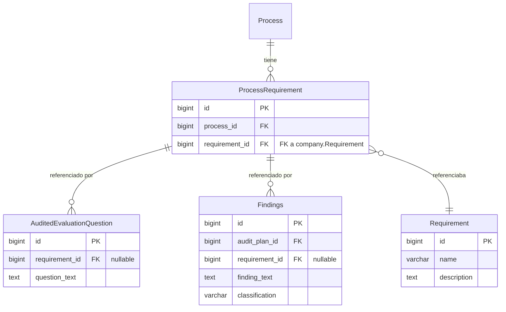
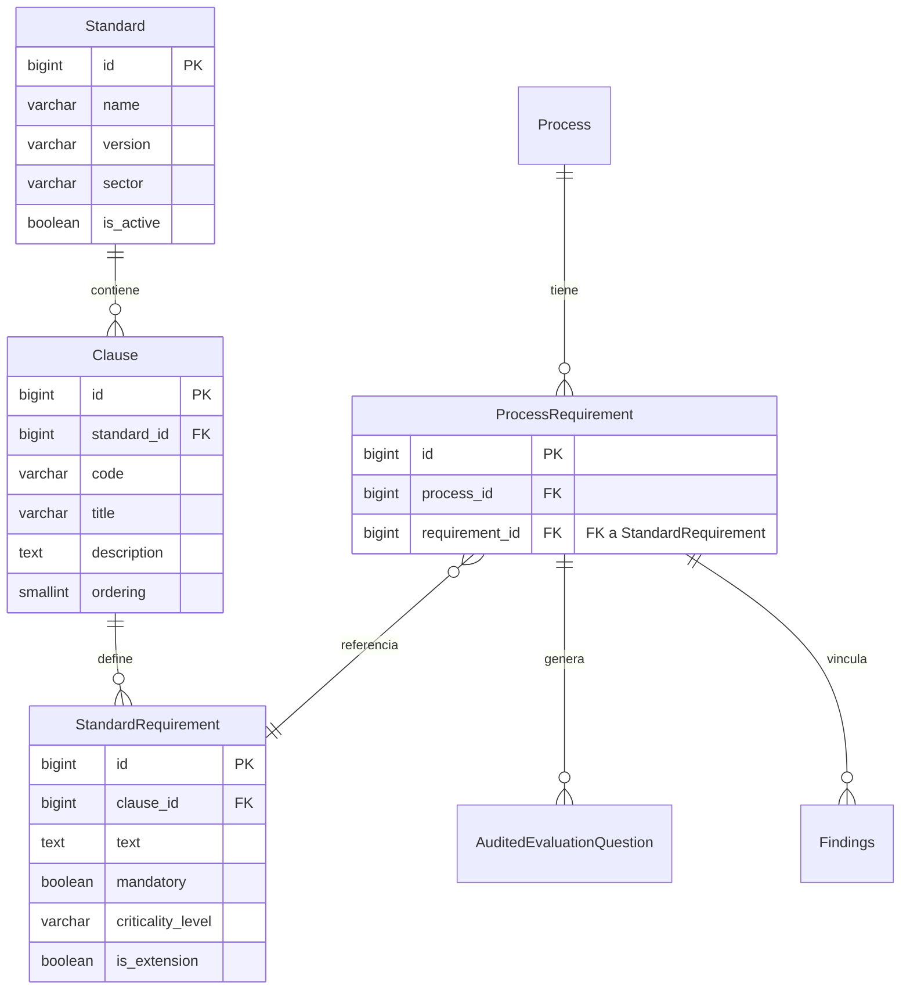

# Refactorización de ProcessRequirement — Integración con Dominio Normativo Estructurado

**Issue:** F0-2 — Refactor ProcessRequirement to use FK to StandardRequirement  
**Fase:** FASE 0 — Integración del Dominio Normativo  
**Dependencias:** F0-0 (Plan de Refactorización), F0-1 (Modelos Normativos Estructurados)  
**Impacto arquitectónico:** Crítico  

---

## Tabla de Contenidos

1. [Contexto y Motivación](#1-contexto-y-motivación)
2. [Estado Anterior del Modelo](#2-estado-anterior-del-modelo)
3. [Cambios Implementados](#3-cambios-implementados)
4. [Estrategia de Migración](#4-estrategia-de-migración)
5. [Actualización de Capas Dependientes](#5-actualización-de-capas-dependientes)
6. [Verificación y Pruebas](#6-verificación-y-pruebas)
7. [Impacto Arquitectónico](#7-impacto-arquitectónico)
8. [Conclusiones](#8-conclusiones)

---

## 1. Contexto y Motivación

### 1.1 Problema de Partida

Antes de esta issue, el modelo `ProcessRequirement` referenciaba los requisitos normativos mediante una `ForeignKey` al modelo antiguo `company.Requirement`:

```python
class ProcessRequirement(models.Model):
    process = models.ForeignKey(Process, on_delete=models.CASCADE)
    requirement = models.ForeignKey(
        'company.Requirement',
        on_delete=models.CASCADE,
        verbose_name="Requirement Name"
    )

    class Meta:
        db_table = 'tb_audit_process_requirements'
        unique_together = ('process', 'requirement')
```

Esta implementación impedía:

- **Trazabilidad normativa:** No era posible saber a qué norma, versión o cláusula pertenecía un requisito.
- **Soporte multinorma:** No había forma de distinguir entre requisitos de ISO 9001:2015 y AS9100.
- **Análisis automatizado por IA:** La función `classify_finding_ia` trabajaba con texto libre, sin contexto normativo estructurado.
- **Integridad referencial:** Un requisito podía tener cualquier texto sin validación contra las cláusulas reales de la norma.
- **Extensibilidad:** Añadir soporte para nuevas normas requería cambios estructurales profundos.

### 1.2 Objetivo de la Issue

Sustituir la `ForeignKey` al modelo antiguo `company.Requirement` por una `ForeignKey` al nuevo modelo `standards.StandardRequirement`, conectando `ProcessRequirement` con el dominio normativo estructurado implementado en F1-2 (`standards` app).

El resultado esperado es una cadena de trazabilidad completa:

```
Process → ProcessRequirement → StandardRequirement → Clause → Standard
```

---

## 2. Estado Anterior del Modelo

### 2.1 Diagrama ER — Estado previo a F0-2



### 2.2 Limitaciones Identificadas

| Limitación | Descripción | Impacto |
|---|---|---|
| Sin jerarquía | No había cláusula ni norma asociada | No trazabilidad |
| Sin validación | Cualquier texto era válido | Datos inconsistentes |
| Sin extensibilidad | No soportaba múltiples normas | Bloqueo arquitectónico |
| Sin metadatos | Sin `mandatory`, `criticality_level` | Sin análisis de riesgo normativo |
| `unique_together` frágil | Unicidad basada en texto libre | Duplicados semánticos posibles |

---

## 3. Cambios Implementados

### 3.1 Modificación del Modelo `ProcessRequirement`

**Archivo:** `audits/models.py`

```python
# ANTES
from company.models import Area, Requirement
# ...
class ProcessRequirement(models.Model):
    process = models.ForeignKey(
        Process,
        on_delete=models.CASCADE
    )
    requirement = models.CharField(
        max_length=200,
        verbose_name="Requirement Name"
    )

    class Meta:
        db_table = 'tb_audit_process_requirements'
        unique_together = ('process', 'requirement')
```

```python
# DESPUÉS
from standards.models import StandardRequirement
# ...
class ProcessRequirement(models.Model):
    process = models.ForeignKey(
        Process,
        on_delete=models.CASCADE
    )
    requirement = models.ForeignKey(
        StandardRequirement,
        on_delete=models.PROTECT,
        verbose_name="Standard Requirement"
    )

    class Meta:
        db_table = 'tb_audit_process_requirements'
```

**Decisiones de diseño:**

- Se usa `on_delete=models.PROTECT` en lugar de `CASCADE` para evitar eliminar accidentalmente un `StandardRequirement` que esté siendo referenciado por procesos activos.
- Se elimina `unique_together` porque la unicidad semántica ya no se puede garantizar con texto libre — ahora la FK gestiona la integridad referencial.
- Se elimina el import de `Requirement` de `company.models` que había quedado como dependencia obsoleta.

### 3.2 Diagrama ER — Estado posterior a F0-2



### 3.3 Corrección de `as_dict()` en Modelos Dependientes

Al cambiar la FK de `company.Requirement` a `standards.StandardRequirement`, los métodos `as_dict()` que accedían a `.requirement` dejaban de funcionar correctamente porque el nuevo modelo expone el texto del requisito en el campo `.text`, mientras que el modelo antiguo `company.Requirement` lo exponía de forma diferente.

Es importante entender la cadena de relaciones tras el refactor:

AuditedEvaluationQuestion.requirement  →  ProcessRequirement
ProcessRequirement.requirement          →  StandardRequirement
StandardRequirement.text                →  texto del requisito

Por tanto, para obtener el texto del requisito desde
`AuditedEvaluationQuestion` hay que recorrer dos FK:
`self.requirement.requirement.text`

Se corrigieron dos modelos:

**`AuditedEvaluationQuestion.as_dict()` — `audits/models.py`**

```python
# ANTES
# self.requirement apuntaba a ProcessRequirement, cuyo campo requirement
# era una FK a company.Requirement. Se accedía con .requirement para
# obtener el objeto company.Requirement, que se serializaba directamente.
def as_dict(self):
    return {
        "id": self.id,
        "requirement": self.requirement.requirement if self.requirement else None,
        "question_text": self.question_text,
    }

# DESPUÉS
# self.requirement apunta a ProcessRequirement (FK).
# ProcessRequirement.requirement apunta a StandardRequirement (FK).
# StandardRequirement.text contiene el texto real del requisito.
def as_dict(self):
    return {
        "id": self.id,
        "requirement": self.requirement.requirement.text if self.requirement else None,
        "question_text": self.question_text,
    }
```

**`Findings.as_dict()` — `audits/models.py`**

```python
# ANTES
# Mismo patrón: .requirement accedía al objeto company.Requirement
# a través de ProcessRequirement.
def as_dict(self):
    return {
        ...
        "requirement": self.requirement.requirement if self.requirement else None,
        ...
    }

# DESPUÉS
# Recorre la cadena completa hasta el texto del StandardRequirement
def as_dict(self):
    return {
        ...
        "requirement": self.requirement.requirement.text if self.requirement else None,
        ...
    }
```

La cadena de acceso `self.requirement.requirement.text` se explica así:
- `self.requirement` → objeto `ProcessRequirement` (FK desde el modelo)
- `.requirement` → objeto `StandardRequirement` (FK dentro de ProcessRequirement)
- `.text` → campo de texto con el contenido real del requisito normativo

Nótese que en el estado anterior, `.requirement` sobre `ProcessRequirement`
devolvía un string directamente porque era un `CharField`. Tras el refactor,
devuelve un objeto `StandardRequirement`, por lo que hay que acceder
explícitamente a su campo `.text`.


---

## 4. Estrategia de Migración

### 4.1 Decisión Arquitectónica

Tal y como se definió en el documento `multinorm_refactor_plan.md` (sección 5.5), se optó por una **reconstrucción desde cero** de los datos de `ProcessRequirement` en lugar de un mapeo automático de texto libre a `StandardRequirement`.

**Justificación:**

1. El proyecto está en fase de desarrollo con datos de prueba sin valor productivo.
2. El mapeo automático (fuzzy matching) de texto libre a cláusulas ISO no garantiza corrección semántica.
3. La reconstrucción manual asegura que cada `ProcessRequirement` apunte al `StandardRequirement` correcto.
4. El objetivo del TFG es demostrar la arquitectura multinorma, no resolver problemas complejos de migración.

### 4.2 Proceso de Limpieza de Datos

Antes de ejecutar la migración de Django, se eliminaron los datos dependientes para evitar violaciones de integridad referencial:

```python
# Ejecutado desde Django shell
from audits.models import Findings, AuditedEvaluationQuestion, ProcessRequirement

# Los campos requirement en Findings y AuditedEvaluationQuestion son nullable
Findings.objects.all().update(requirement=None)
AuditedEvaluationQuestion.objects.all().update(requirement=None)

# Eliminar todos los ProcessRequirement existentes (datos de prueba)
ProcessRequirement.objects.all().delete()
```

### 4.3 Migración de Django

Se generó la migración con nombre descriptivo:

```bash
python manage.py makemigrations audits --name="replace_requirement_charfield_with_fk"
python manage.py migrate
```

**Archivo generado:** `audits/migrations/0008_replace_requirement_charfield_with_fk.py`

La migración realiza las siguientes operaciones sobre la tabla `tb_audit_process_requirements`:

1. Elimina la constraint `unique_together` sobre `(process_id, requirement)`
2. Elimina la FK antigua `requirement_id` que apuntaba a `tb_company_requirements`
3. Añade la nueva FK `requirement_id` de tipo `BIGINT` apuntando a `tb_standards_requirements`
2. Aplica la constraint `ON DELETE PROTECT`

---

## 5. Actualización de Capas Dependientes

### 5.1 Formularios — `audits/forms.py`

El widget del campo `requirement` en `ProcessRequirementForm` se actualizó de `TextInput` a `Select`, ya que Django renderiza automáticamente las FK como campos de selección:

```python
# ANTES
class ProcessRequirementForm(forms.ModelForm):
    class Meta:
        model = ProcessRequirement
        fields = ['process', 'requirement']
        widgets = {
            'process': forms.Select(attrs={'class': 'form-control'}),
            'requirement': forms.TextInput(attrs={'class': 'form-control'}),
        }

# DESPUÉS
class ProcessRequirementForm(forms.ModelForm):
    class Meta:
        model = ProcessRequirement
        fields = ['process', 'requirement']
        widgets = {
            'process': forms.Select(attrs={'class': 'form-control'}),
            'requirement': forms.Select(attrs={'class': 'form-control'}),
        }
```

### 5.2 Vistas — `audits/views.py`

Se corrigieron tres puntos en las vistas:

**Cambio 1 y 2 — `audits_home` y `annual_audit_program`**

Ambas funciones contenían el mismo bloque que acumulaba requisitos por proceso. El acceso a `.requirement` (que antes era string) se actualizó para acceder a `.requirement.text`:

```python
# ANTES
requirements_by_process = defaultdict(list)
for pr in ProcessRequirement.objects.select_related("process"):
    requirements_by_process[pr.process_id].append(pr.requirement)

# DESPUÉS
requirements_by_process = defaultdict(list)
for pr in ProcessRequirement.objects.select_related("process", "requirement"):
    requirements_by_process[pr.process_id].append(pr.requirement.text)
```

Se añadió `"requirement"` al `select_related` para evitar N+1 queries al acceder a `.requirement.text`.

**Cambio 3 — `save_selected_audit_question`**

Esta función importaba incorrectamente `Requirement` de `company.models` en lugar de usar `ProcessRequirement`:

```python
# ANTES
from company.models import Requirement
# ...
requirement = Requirement.objects.get(pk=requirement_id)

# DESPUÉS
# (ProcessRequirement ya está importado en el módulo)
requirement = ProcessRequirement.objects.get(pk=requirement_id)
```

### 5.3 Funciones de IA — `ai_functions/monitoring_functions.py`

La función `classify_finding_ia` accedía al campo `requirement` del objeto `ProcessRequirement` usando `getattr`, esperando un string. Con la FK, este acceso devuelve un objeto `StandardRequirement`, no un texto:

```python
# ANTES
clause_identifier = ""
if requirement_obj:
    clause_identifier = getattr(requirement_obj, "requirement", "")

# DESPUÉS
clause_identifier = ""
if requirement_obj:
    std_req = getattr(requirement_obj, "requirement", None)
    if std_req:
        clause_identifier = getattr(std_req, "text", "")
```

Este cambio permite que la IA reciba el texto real del requisito normativo (por ejemplo: `"La organización debe determinar las cuestiones externas e internas..."`) como contexto para clasificar hallazgos, mejorando la calidad de la clasificación automática.

### 5.4 Dashboard — `pages/views.py`

Las queries del dashboard que atraviesan `ProcessRequirement` no requirieron cambios. Las agregaciones que usan el nombre del modelo para traversar relaciones funcionan independientemente del tipo de campo `requirement`:

```python
# Esta query NO requirió cambios — usa nombre de modelo, no el campo requirement
processes_with_findings = Process.objects.annotate(
    total_findings=Count('processrequirement__findings')
)
```

---

## 6. Verificación y Pruebas

### 6.1 Verificación Estructural

```bash
python manage.py check
# Resultado: System check identified no issues (0 silenced).
```

### 6.2 Prueba Funcional — Creación de ProcessRequirement

Se creó un `ProcessRequirement` de prueba con la siguiente estructura completa desde el panel de administración:

| Nivel | Valor |
|---|---|
| **Standard** | ISO 9001:2015 |
| **Clause** | 4.1 — Comprensión de la organización y su contexto |
| **StandardRequirement** | La organización debe determinar las cuestiones externas e internas que son pertinentes para su propósito... |
| **Process** | Integración de Sistemas Eléctricos |
| **ProcessRequirement** | Process → StandardRequirement (creado correctamente) |

### 6.3 Resultados de Verificación

| Punto de verificación | Resultado |
|---|---|
| `manage.py check` sin errores | ✅ |
| Migración aplicada sin pérdida de datos | ✅ |
| Admin panel `ProcessRequirement` muestra Select de `StandardRequirement` | ✅ |
| Creación de `ProcessRequirement` desde admin | ✅ |
| Dashboard principal carga sin errores | ✅ |
| Vista `conduct_internal_audits` carga sin errores | ✅ |

---

## 7. Impacto Arquitectónico

### 7.1 Cadena de Trazabilidad Conseguida

Tras esta issue, el sistema cuenta con trazabilidad normativa completa en ambas direcciones:

```
# Desde un hallazgo, llegar a la norma
finding.requirement.requirement.clause.standard.name
# → "ISO 9001:2015"

finding.requirement.requirement.clause.code
# → "4.1"

finding.requirement.requirement.text
# → "La organización debe determinar las cuestiones externas..."

# Desde un proceso, listar todos sus requisitos normativos estructurados
ProcessRequirement.objects.filter(process=proceso).select_related(
    "requirement__clause__standard"
)
```

### 7.2 Mejora en Calidad de Análisis IA

La función `classify_finding_ia` ahora recibe el texto real del requisito normativo como contexto, en lugar de un string libre. Esto mejora la precisión de la clasificación automática de hallazgos (`NC_MAYOR`, `NC_MENOR`, `OPORTUNIDAD_MEJORA`).

### 7.3 Preparación para Fases Futuras

Esta refactorización habilita directamente:

- **Soporte AS9100:** Simplemente se crean nuevos `Standard`, `Clause` y `StandardRequirement` para AS9100, y los `ProcessRequirement` pueden apuntar a ellos sin cambios de modelo.
- **Análisis de cumplimiento por norma:** Las queries pueden filtrar por `requirement__clause__standard`.
- **Mapeo normativo ISO 9001 ↔ AS9100:** La arquitectura de `StandardMapping` definida en F1-1 puede implementarse sobre esta base.
- **Automatización de auditorías:** Con requisitos estructurados, es posible generar checklists automáticos basados en cláusulas obligatorias (`mandatory=True`).

---

## 8. Conclusiones

Esta issue completa la **Fase 0 — Integración del Dominio Normativo** de NormAI. Los tres entregables de la fase quedan enlazados:

- **F0-0:** Definió el plan arquitectónico y la estrategia de migración.
- **F0-1:** Implementó los modelos `Standard`, `Clause` y `StandardRequirement` en la app `standards`.
- **F0-2:** Conectó el dominio normativo con el módulo de auditorías mediante la refactorización de `ProcessRequirement`.

El sistema pasa de almacenar requisitos como texto plano a referenciar requisitos normativos estructurados con jerarquía de cláusulas, metadatos de criticidad y soporte multinorma. Esto sienta las bases técnicas para las siguientes fases del proyecto, especialmente las relacionadas con análisis de cumplimiento automatizado e integración IA.

---